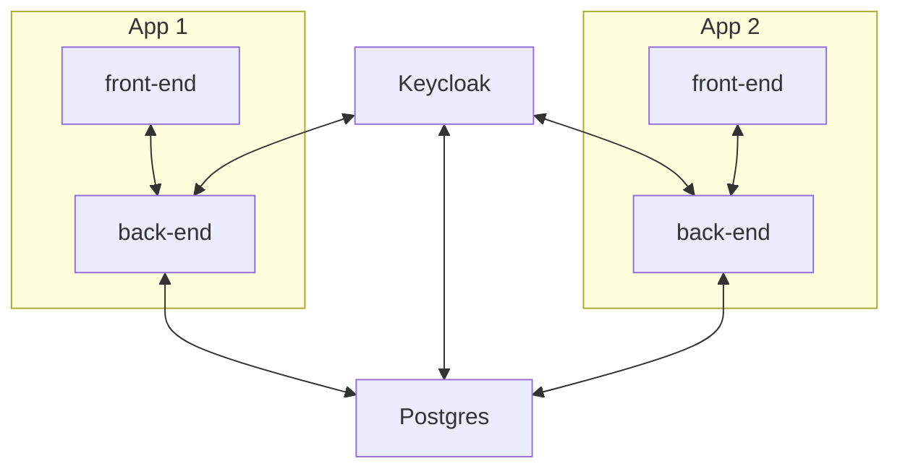

# Local Infrastructure Services

## Background

This is an experiment of an idea to run common services, which I will conveniently call "infrastructure" for lack of a better word, to run as independent Docker containers instead of being included as a "service" in a containerized app's `compose.yaml`. These services may include, but are not limited to, (1) Postgres server, (2) Redis/ValKey server, (3) MQTT server, etc.

This idea came about because I wanted to try out [Keycloak](https://www.keycloak.org/) -- an Open Source Identity and Access Management tool -- as the IAM solution for signing in to web applications during development in my local development machine. Since Keycloak uses the Postgres database, I wanted to try if I can run one Keycloak container, one Postgres container, and multiple web applications to connect to both services. Thus the idea for `local-infra-services`.

I also thought that this would simulate a real-world setup where only one instance of Keycloak setup to handle all the IAM for the different web applications thus enabling single sign-on to all the applications.

## Understanding

This is how I envisioned it on my mind. I don't know if this is a feasible setup, but that's the reason for this experimentation.

## Implementation

This experiment will utilize Docker tools and containerization technologies. For local development, it will employ the Docker Desktop application and the Docker Compose tool.

Here are some other tools and applications that I am considering of using (as of Apr 2025) for this experiment:

1. Excalidraw
2. Keycloak
3. PostgreSQL

## Lesson(s) Learned

TBD

## Deliverables

TBD
